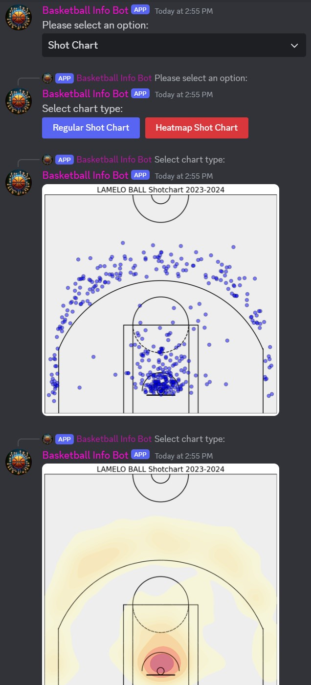
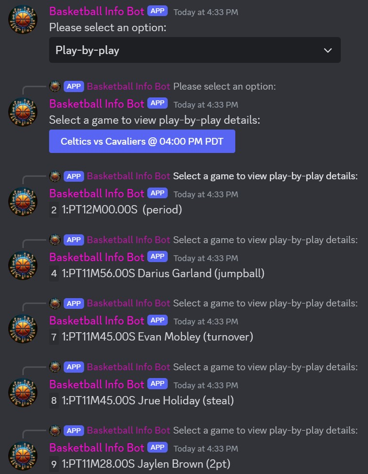
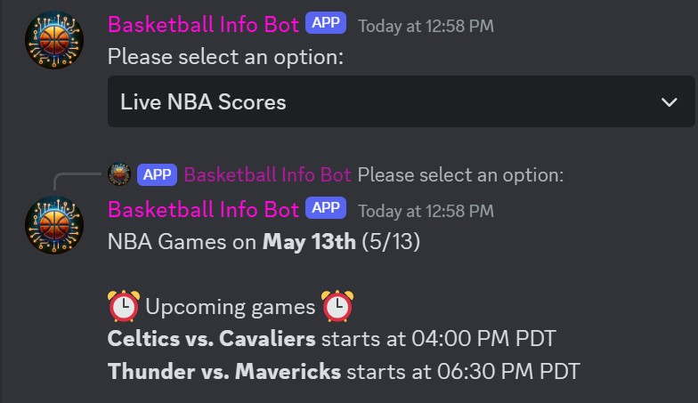
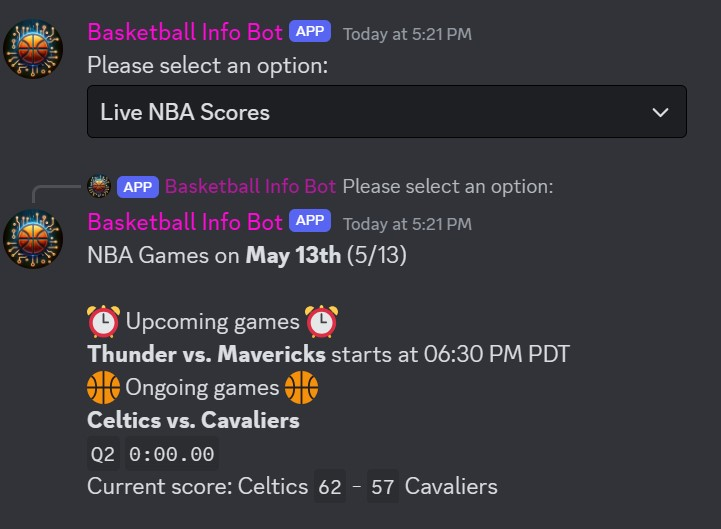
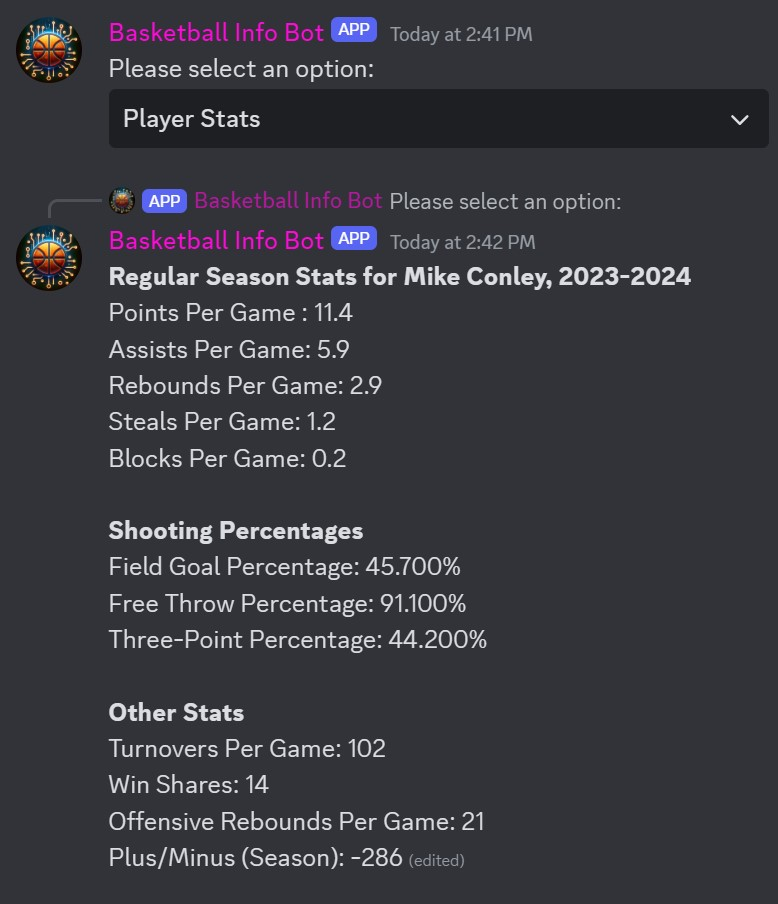
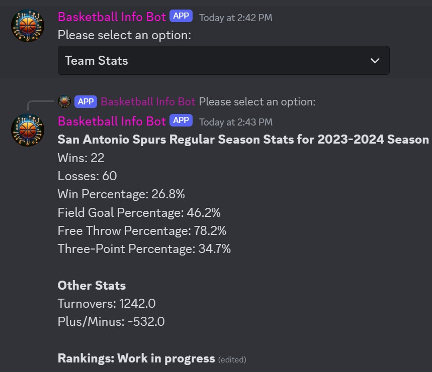
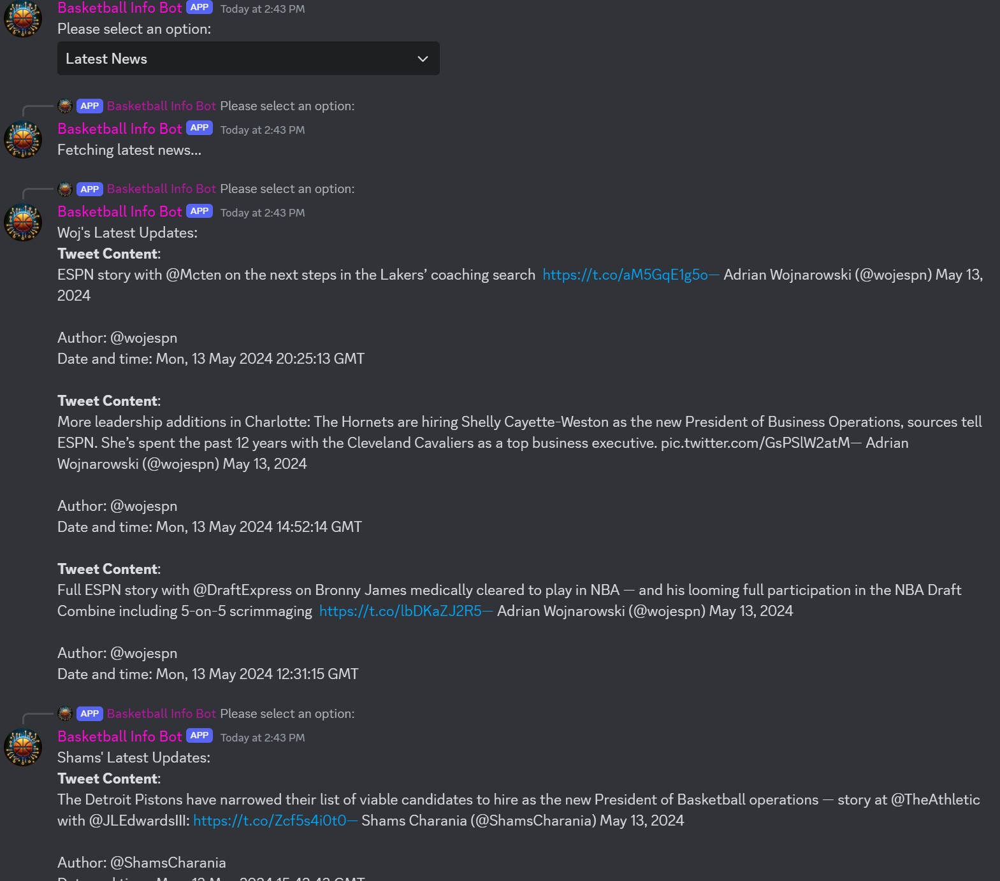

# BASKETBALL DISCORD BOT

## Faster play-by-plays than ESPN Gamecast and NBA.com!
https://github.com/AdityaRao127/BBALLHQ-DISCORD-BOT/assets/142644352/47903607-254a-4682-921e-32b19cfe1fb6

## Other features:
https://github.com/AdityaRao127/BBALLHQ-DISCORD-BOT/assets/142644352/5e9fc2d2-d302-4972-ac85-fbaa1e1faf1c


## Features


### Shot Chart


### Play-by-play


### Scoreboard Example 1


### Scoreboard Example 2


### Player Stats


### Team Stats


### Latest News


## Contributions are welcome! Here's how to contribute:

1. Clone the repository:
   ```bash
   git clone https://github.com/AdityaRao127/discordbot.git
   cd discordbot

2. Create a virtual environment:
   ```python -m venv venv```

3. Activate virtual environment:
   #### Windows
   ```./venv/Scripts/activate```

   #### macOS and Linux
   ```source venv/bin/activate```

4. Installing dependencies
   ```bash
   pip install -r requirements.txt

5. Setting Up a Test Discord Bot

   To contribute to the bot's development without the production bot token, you should set up a test Discord bot:
   
   1. Go to the [Discord Developer Portal](https://discord.com/developers/applications).
   2. Create a new application and name it (ex: testbot) 
   3. Under the "Bot" tab, click "Add Bot".
   4. You will see a token under the bot username, click "Copy" to get your test bot token.
   5. Use this token in your local `.env` file:

5. Running and Testing the Bot

   #### Reference the [.env.example](.env.example) file at the top
   
   ```bash
   # create .env file with the following :
   DISCORD_TOKEN = discord_token_here ( see below)
   DISCORD_CHANNEL = discord_channel
   DISCORD_WOJ_TWEETS = Contact me for RSS FEED
   DISCORD_SHAMS_TWEETS = Contact me for RSS Feed

To **start the bot**, run the `main.py` file. The bot will appear online and start functioning as expected.
To **stop the bot,** press `Ctrl + C` in the terminal or close the python terminal window.

6. Check out [notes.txt](notes.txt) for ideas in development! Suggest new ones in [Issues](https://github.com/AdityaRao127/discordbot/issues)


### Check out my GitHub Profile!
[](https://github.com/AdityaRao127)
