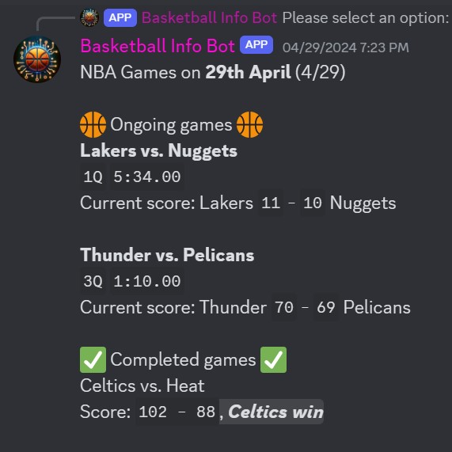

# BASKETBALL DISCORD BOT

## Features

### Shot Chart


### Play-by-play


### Scoreboard Example 1


### Scoreboard Example 2


### Player Stats


### Team Stats


### Latest News


1. Clone the repository:
   ```bash
   git clone https://github.com/AdityaRao127/discordbot.git
   cd discordbot

2. Create a virtual environment:
   ```python -m venv venv```

3. Activate virtual environment:
   #### Windows
   ```./venv/Scripts/activate```

   #### macOS and Linux
   ```source venv/bin/activate```

4. Installing dependencies
   ```bash
   pip install -r requirements.txt

5. Running and testing the bot

   #### Reference the [.env.example](.env.example) file at the top
   
   ```bash
   # create .env file with the following :
   DISCORD_TOKEN = discord_token_here ( see below)
   DISCORD_CHANNEL = discord_channel
   DISCORD_WOJ_TWEETS = Contact me for RSS FEED
   DISCORD_SHAMS_TWEETS = Contact me for RSS Feed

### Setting Up a Test Discord Bot

To contribute to the bot's development without the production bot token, you should set up a test Discord bot:

1. Go to the [Discord Developer Portal](https://discord.com/developers/applications).
2. Create a new application and name it (ex: testbot) 
3. Under the "Bot" tab, click "Add Bot".
4. You will see a token under the bot username, click "Copy" to get your test bot token.
5. Use this token in your local `.env` file:
   
   
